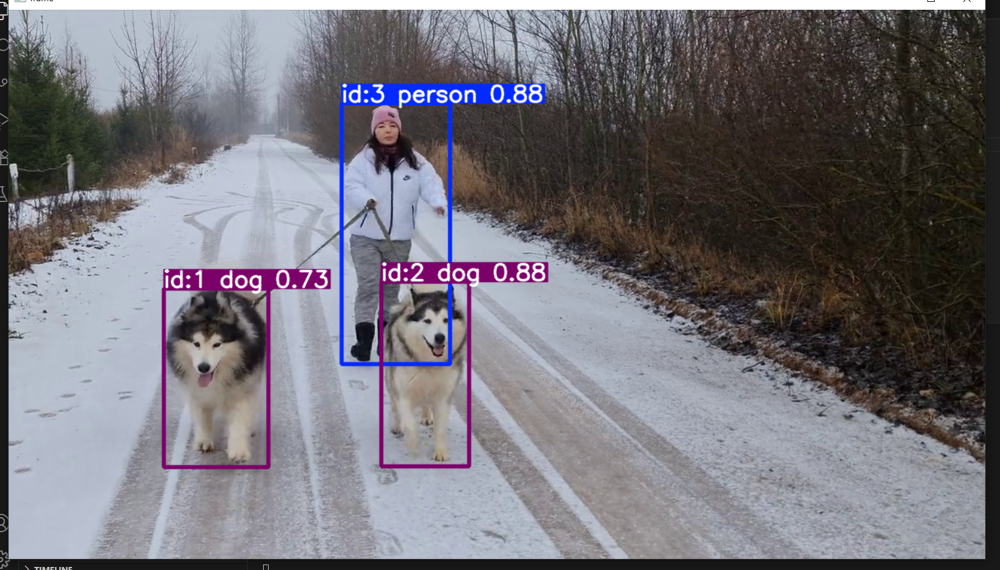

# 🚀 **YOLOV8 OBJECT TRACKING** 🔍  
### BY ANURAG SAINI  

---

## 🔗 **DIRECT DOWNLOAD LINK TO START**  
### 👉 [PIP INSTALL ULTRALYTICS](https://pypi.org/project/ultralytics/) 👈

---

## 🌟 INTRODUCTION  
Welcome to one of the **most seamless, real-time object tracking projects** ever created using **YOLOv8**. This isn’t just another detection app—it's an eye-catching, ultra-precise tracker that walks (literally!) alongside two furry companions. Built with care, clarity, and the latest in AI detection, this project brings your video frames to life with intelligent object annotation.

This isn’t just code—**it’s an experience**.

---

## 👁️‍🗨️ WHAT IT DOES  
🎯 Real-time object tracking on video input  
🐶 Detects & tracks multiple classes (dogs, persons, etc.)  
🧠 Utilizes YOLOv8's new `track()` function with `persist=True`  
📸 Visualizes results frame-by-frame using OpenCV  

---

## 📸 DEMO SNAPSHOT  

---

## 📼 WANT TO SEE THE FULL ACTION?  
### ▶️ **[CLICK HERE TO DOWNLOAD VIDEO](https://drive.google.com/file/d/1sx0rB3KeTxZ9m-Nfkt0U1TtEwsxZxX8O/view?usp=sharing)**  

---

## 🚀 GETTING STARTED  

Before diving into the magic, install the core engine:

### ✨ **`pip install ultralytics`** ✨  
*This command installs the YOLOv8 framework you're about to witness in action.*

---

## 🧠 CREDITS  

Crafted with 💻 and 🧠 by **ANURAG SAINI**  
Made for those who believe in beautiful AI.

---

# 🌟🌟🌟  
## **IF YOU APPRECIATE MY WORK PLEASE GIVE STAR ⭐ AND BE MY STAR 🌟**  
# 🌟🌟🌟

---
